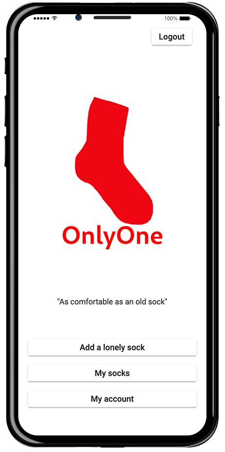

# About OnlyOne   
OnlyOne wishes to solve the problem of the "lonely sock who is alone after having washed your clothes".
The app is a webapp (SPA) with angular for the front and golang for the REST API (backend). Therefore once running it can be used by any browser. We wanted to do a mobile-first app but also support desktop therefor we choose [Angular](https://angular.io/).

## How does it work ?
OnlyOne lets you create a profile, adds socks to it and matchs with other socks ! it's that simple!
If you accept another sock as a match, and the owner of the other sock accepts yours, then you have a match (denoted by the little heart in the UI). Having a match mean that you have 0.5 chance to get his sock and 0.5 chance of lossing yours.

If you loose you sock, you'll have instruction on how to send it to the winner.

### Don't play if you are not willing to loose your sock

## OnlyOne Documentation
The setup instruction are split in two, the front and the back.
The front instruction are in the [README.md](./frontend/README.md) file.
The back instruction are in the [README.md](./backend/README.md) file.

## The production environment
The workflow to deploy is as follow : 
    - A PR is merged in main
    - Github notifies the [webhook server](https://github.com/OneSock-inc/Infra) of the merge
    - The webhook downloads this repo and run a docker-compose up command
    - The services are updated with the latest version of the code

You can find more about the watcher in the infra repo of our organisation
